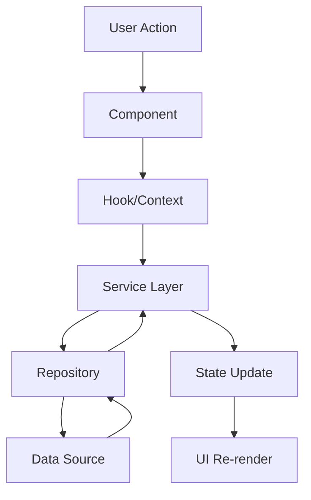

# 🏗️ Comprehensive Architecture Guide

## Table of Contents
- [System Overview](#system-overview)
- [Architecture Patterns](#architecture-patterns)
- [Component Architecture](#component-architecture)
- [Data Flow](#data-flow)
- [Security Architecture](#security-architecture)
- [Performance Architecture](#performance-architecture)
- [Testing Architecture](#testing-architecture)
- [Deployment Architecture](#deployment-architecture)

## System Overview

### 🎯 Architecture Vision
The Arogyam Clinic Management System follows a **microservice-ready, component-based architecture** with enterprise-grade patterns and practices.

### 🏛️ Core Principles
- **Separation of Concerns**: Clear boundaries between layers
- **Single Responsibility**: Each component has one job
- **Open/Closed Principle**: Open for extension, closed for modification
- **Dependency Inversion**: Depend on abstractions, not concretions
- **Command Query Responsibility Segregation (CQRS)**
- **Event-Driven Architecture**

## Architecture Patterns

### 🔄 Design Patterns Implemented

#### 1. Singleton Pattern
```typescript
// Configuration Manager - ensures single instance
export class ConfigurationManager {
  private static instance: ConfigurationManager;
  
  public static getInstance(): ConfigurationManager {
    if (!ConfigurationManager.instance) {
      ConfigurationManager.instance = new ConfigurationManager();
    }
    return ConfigurationManager.instance;
  }
}
```

#### 2. Factory Pattern
```typescript
// Service Factory - creates services dynamically
export class ServiceFactory {
  public static createService(type: string): IService {
    const serviceCreator = this.services.get(type);
    if (!serviceCreator) {
      throw new Error(`Service type "${type}" not found`);
    }
    return serviceCreator();
  }
}
```

#### 3. Observer Pattern
```typescript
// Event System - publish/subscribe mechanism
export class EventSubject<T> implements ISubject<T> {
  private observers: Set<IObserver<T>> = new Set();
  
  public notify(data: T): void {
    this.observers.forEach(observer => observer.update(data));
  }
}
```

#### 4. Repository Pattern
```typescript
// Data Access Layer
export abstract class BaseRepository<T extends { id: string }> 
  implements IRepository<T> {
  
  protected cache: Map<string, T> = new Map();
  
  public async findById(id: string): Promise<T | null> {
    // Check cache first, then data source
  }
}
```

#### 5. Strategy Pattern
```typescript
// Validation Strategies
export class ValidationContext {
  private strategy: IValidationStrategy;
  
  public validate(data: any): { valid: boolean; errors: string[] } {
    return this.strategy.validate(data);
  }
}
```

#### 6. Command Pattern
```typescript
// Action Management with Undo/Redo
export class CommandInvoker {
  private history: ICommand[] = [];
  
  async executeCommand(command: ICommand): Promise<any> {
    const result = await command.execute();
    this.history.push(command);
    return result;
  }
}
```

#### 7. Circuit Breaker Pattern
```typescript
// Fault Tolerance
export class CircuitBreaker {
  private state: CircuitState = CircuitState.CLOSED;
  
  public async execute<T>(operation: () => Promise<T>): Promise<T> {
    if (this.state === CircuitState.OPEN) {
      throw new Error(`Circuit breaker is OPEN`);
    }
    // Execute with failure tracking
  }
}
```

### 🏗️ Architectural Layers

```
┌─────────────────────────────────────────┐
│           Presentation Layer            │
│  ┌─────────────┐  ┌─────────────────┐   │
│  │ React       │  │ Context         │   │
│  │ Components  │  │ Providers       │   │
│  └─────────────┘  └─────────────────┘   │
└─────────────────────────────────────────┘
│
┌─────────────────────────────────────────┐
│            Business Layer               │
│  ┌─────────────┐  ┌─────────────────┐   │
│  │ Services    │  │ State           │   │
│  │ & Managers  │  │ Management      │   │
│  └─────────────┘  └─────────────────┘   │
└─────────────────────────────────────────┘
│
┌─────────────────────────────────────────┐
│           Data Access Layer             │
│  ┌─────────────┐  ┌─────────────────┐   │
│  │ Repositories│  │ Caching         │   │
│  │ & Adapters  │  │ Strategies      │   │
│  └─────────────┘  └─────────────────┘   │
└─────────────────────────────────────────┘
│
┌─────────────────────────────────────────┐
│           Infrastructure Layer          │
│  ┌─────────────┐  ┌─────────────────┐   │
│  │ Supabase    │  │ External        │   │
│  │ Database    │  │ APIs            │   │
│  └─────────────┘  └─────────────────┘   │
└─────────────────────────────────────────┘
```

## Component Architecture

### 📦 Component Structure

```
components/
├── ui/                    # Reusable UI components
│   ├── Button/
│   ├── Input/
│   └── Modal/
├── business/              # Business logic components
│   ├── ConsultationForm/
│   ├── PatientManager/
│   └── PrescriptionEditor/
├── layout/                # Layout components
│   ├── Header/
│   ├── Sidebar/
│   └── Footer/
├── context/               # React context providers
│   ├── AuthContext/
│   ├── ThemeContext/
│   └── DataContext/
└── hooks/                 # Custom React hooks
    ├── useAuth/
    ├── useApi/
    └── useLocalStorage/
```

### 🔄 Data Flow Architecture



## Security Architecture

### 🔐 Security Layers

#### 1. Authentication Layer
- Multi-Factor Authentication (MFA)
- JWT-based session management
- Rate limiting and account lockout
- CSRF protection

#### 2. Authorization Layer
- Role-Based Access Control (RBAC)
- Permission-based resource access
- API endpoint protection

#### 3. Data Protection Layer
- Input validation and sanitization
- SQL injection prevention
- XSS protection
- Data encryption at rest and in transit

#### 4. Monitoring Layer
- Security audit logging
- Real-time threat detection
- Suspicious activity tracking
- Compliance reporting

### 🛡️ Security Implementation

```typescript
// Multi-layered security approach
class SecurityMiddleware {
  async authenticate(request: Request): Promise<User> {
    // 1. Validate JWT token
    // 2. Check MFA if required
    // 3. Verify session validity
    // 4. Log authentication attempt
  }
  
  async authorize(user: User, resource: string, action: string): Promise<boolean> {
    // 1. Check user roles
    // 2. Verify permissions
    // 3. Apply resource-level access control
    // 4. Log authorization decision
  }
}
```

## Performance Architecture

### ⚡ Performance Strategies

#### 1. Code Splitting
```typescript
// Route-based code splitting
const AdminDashboard = lazy(() => import('./components/AdminDashboard'));
const PatientPortal = lazy(() => import('./components/PatientPortal'));
```

#### 2. Caching Strategy
```typescript
// Multi-level caching
class CacheManager {
  private memoryCache = new Map();
  private persistentCache = localStorage;
  
  async get<T>(key: string): Promise<T | null> {
    // 1. Check memory cache
    // 2. Check persistent cache
    // 3. Fetch from source if needed
  }
}
```

#### 3. Bundle Optimization
```javascript
// Vite configuration for optimal bundling
export default defineConfig({
  build: {
    rollupOptions: {
      output: {
        manualChunks: {
          'react-vendor': ['react', 'react-dom'],
          'ui-vendor': ['lucide-react'],
          'data-vendor': ['@supabase/supabase-js']
        }
      }
    }
  }
});
```

## Testing Architecture

### 🧪 Testing Strategy

#### 1. Unit Testing (Jest + React Testing Library)
```typescript
// Component testing example
describe('LoginForm', () => {
  it('should validate credentials correctly', async () => {
    render(<LoginForm />);
    
    await userEvent.type(screen.getByLabelText(/email/i), 'test@example.com');
    await userEvent.type(screen.getByLabelText(/password/i), 'password123');
    await userEvent.click(screen.getByRole('button', { name: /login/i }));
    
    expect(mockLoginFunction).toHaveBeenCalledWith({
      email: 'test@example.com',
      password: 'password123'
    });
  });
});
```

#### 2. Integration Testing
```typescript
// API integration testing
describe('ConsultationAPI', () => {
  it('should create consultation with valid data', async () => {
    const consultation = await consultationService.create(validData);
    expect(consultation).toHaveProperty('id');
    expect(consultation.status).toBe('pending');
  });
});
```

#### 3. End-to-End Testing (Playwright)
```typescript
// E2E workflow testing
test('complete consultation booking flow', async ({ page }) => {
  await page.goto('/');
  await page.click('[data-testid="book-consultation"]');
  await page.fill('[data-testid="patient-name"]', 'John Doe');
  await page.fill('[data-testid="patient-email"]', 'john@example.com');
  await page.click('[data-testid="submit-booking"]');
  
  await expect(page.locator('[data-testid="success-message"]')).toBeVisible();
});
```

### 📊 Test Coverage Goals
- Unit Tests: 95%+ coverage
- Integration Tests: 85%+ coverage
- E2E Tests: Critical user flows (100%)

## Deployment Architecture

### 🚀 Infrastructure Overview

```
┌─────────────────────────────────────────┐
│              CDN Layer                  │
│          (Cloudflare/AWS)               │
└─────────────────────────────────────────┘
│
┌─────────────────────────────────────────┐
│           Load Balancer                 │
│         (Application Layer)             │
└─────────────────────────────────────────┘
│
┌─────────────────┐  ┌─────────────────────┐
│   Frontend      │  │    Backend API      │
│  (Vercel/AWS)   │  │   (AWS Lambda/      │
│                 │  │    Serverless)      │
└─────────────────┘  └─────────────────────┘
│                              │
┌─────────────────────────────────────────┐
│            Database Layer               │
│         (Supabase/PostgreSQL)          │
└─────────────────────────────────────────┘
```

### 🏗️ CI/CD Pipeline

```yaml
# GitHub Actions workflow
name: Production Deployment

on:
  push:
    branches: [main]

jobs:
  test:
    runs-on: ubuntu-latest
    steps:
      - uses: actions/checkout@v3
      - name: Run tests
        run: |
          npm ci
          npm run test:ci
          npm run test:e2e

  security-scan:
    runs-on: ubuntu-latest
    steps:
      - name: Security audit
        run: npm audit --audit-level=moderate
      - name: CodeQL analysis
        uses: github/codeql-action/analyze@v2

  deploy:
    needs: [test, security-scan]
    runs-on: ubuntu-latest
    steps:
      - name: Deploy to production
        run: npm run deploy:prod
```

### 📈 Monitoring & Observability

#### 1. Application Performance Monitoring (APM)
```typescript
// Performance monitoring service
class PerformanceMonitor {
  trackPageLoad(route: string, loadTime: number): void {
    // Send metrics to monitoring service
  }
  
  trackUserInteraction(action: string, duration: number): void {
    // Track user experience metrics
  }
  
  trackError(error: Error, context: Record<string, any>): void {
    // Send error data to error tracking service
  }
}
```

#### 2. Real-time Monitoring Dashboard
- Performance metrics
- Error rates
- User activity
- Security events
- System health

## Scalability Considerations

### 📈 Horizontal Scaling

#### 1. Microservice Architecture
```typescript
// Service isolation
interface IUserService {
  createUser(userData: UserData): Promise<User>;
  getUserById(id: string): Promise<User>;
}

interface IConsultationService {
  createConsultation(data: ConsultationData): Promise<Consultation>;
  getConsultations(filters: Filters): Promise<Consultation[]>;
}
```

#### 2. Database Scaling
- Read replicas for query distribution
- Connection pooling
- Query optimization
- Caching strategies

#### 3. Frontend Scaling
- CDN distribution
- Code splitting
- Lazy loading
- Progressive loading

### 🔄 Future Enhancements

1. **Event Sourcing**: Complete audit trail
2. **CQRS Implementation**: Separate read/write models
3. **Message Queue Integration**: Asynchronous processing
4. **Real-time Features**: WebSocket integration
5. **Progressive Web App**: Offline capabilities
6. **AI Integration**: Smart recommendations
7. **Multi-tenant Architecture**: Clinic isolation
8. **Mobile Application**: React Native implementation

---

**Last Updated**: January 2025
**Version**: 2.0.0
**Maintainer**: Arogyam Development Team